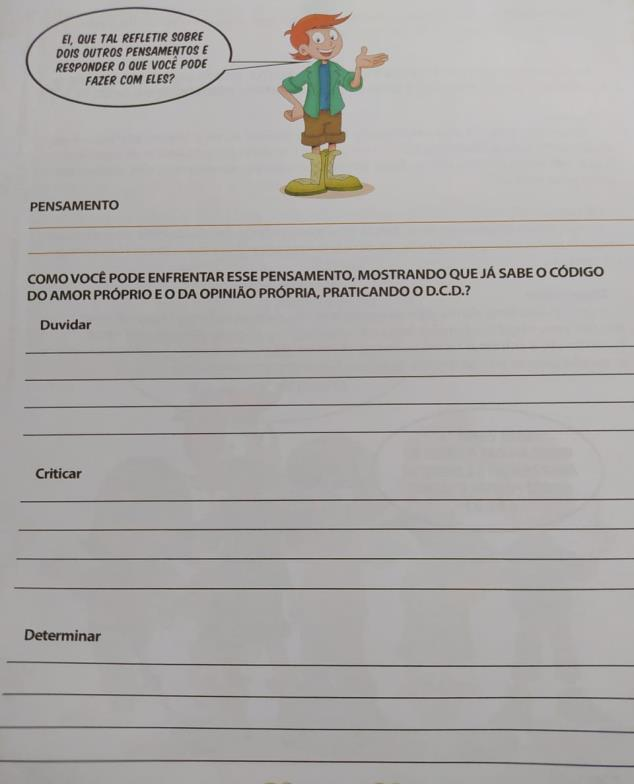
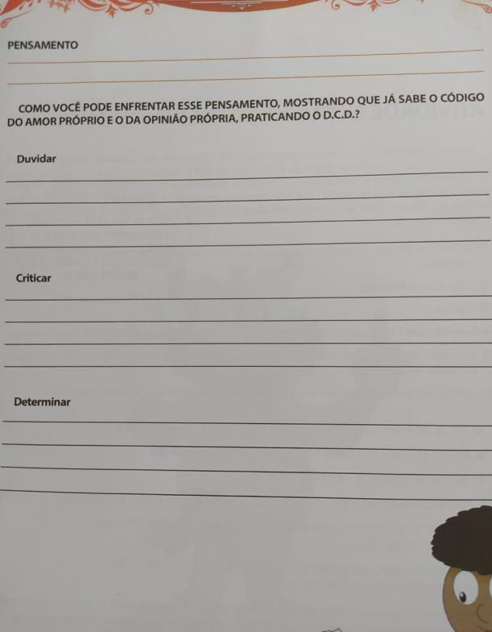

# Atividades do Dia 15/07/2020

## Vídeo-Aulas do Dia:

| Matéria | Assunto |Horário | Link | Meeting ID | Password |
|---------|---------|--------|------|------------|----------|
| Atividade Recreativa | atividade recreativa | 13:30 - 14:00 | [Zoom](https://us04web.zoom.us/j/6425737333?pwd=Y015MWphNlVkVWJlTUlNUS9UM05mdz09) | 642 573 7333 | 10032005 |
| [Ciências](#ciências) | livro de Ciências unidade 6 - Rotação da Terra e revisao | 14:35 - 15:30 | [Zoom](https://zoom.us/j/3196566582?pwd=cFNUb3BrREpzanpQV2toZ09RbjFnUT09) | 319 656 6582 | 7qaBx5 |
| [História](#história) | as primeiras civilizações indígenas das Américas | 15:40 - 16:40 | [Zoom](https://zoom.us/j/3196566582?pwd=cFNUb3BrREpzanpQV2toZ09RbjFnUT09) | 319 656 6582 | 7qaBx5 |
| [Inglês](#inglês) | livro de Inglês | 17:30 - 18:30 | [Zoom](https://zoom.us/j/96832380476?pwd=SlNVTGh2KzROMmhZdUxwdUs2SVM2Zz09) | 968 3238 0476 | 092561 | 
| [Escola da Inteligência](#escola-da-inteligência) | - | - | [Vimeo](https://vimeo.com/421209796) | - | - |

## CIÊNCIAS

* Unidade 6: Rotação da Terra (revisão da unidade). Essa atividade se encontra na atividade complementar da unidade 6.
* Realizar atividades complementares no final do livro de Ciências sobre a unidade 6 (páginas: 182 e 183). Enviá-las, no dia 15/07, pela [plataforma AVA], através da pasta ATIVIDADES (se encontra no MENU, abaixo da Trilha de Aprendizagem).

## HISTÓRIA

### Plano de estudos

* Utilizar o planejamento da [plataforma AVA] Poliedro - Trilhas de Aprendizagem da Semana 08/06a 12/06 – Unidade 6 – A construção de uma nação. Essa atividade se encontra no dia: **09/06**.
* Descrição da trilha de aprendizagem: **leitura, interpretação, noções de Estado e Tratado de Tordesilhas**.
* O aluno deverá seguir as instruções da Trilha de Aprendizagem da [plataforma AVA], realizando os deveres no próprio material didático (livros e/ ou cadernos). Após finalizar as atividades, poderá concluir sua Trilha de Aprendizagem clicando no botão CONCLUIR TRILHA DE APRENDIZAGEM.
* Realizar as atividades do livro de História. (página: 162). Enviá-las, no dia 15/07, pela [plataforma AVA], através da pasta ATIVIDADES (se encontra no MENU, abaixo da Trilha de Aprendizagem)

## INGLÊS

* Realizar atividade do livro de Inglês (página: 70 – exercícios 1 e 2). Enviá-la, no dia 15/07, pela [plataforma AVA], através da pasta ATIVIDADES (se encontra no MENU, abaixo da Trilha de Aprendizagem).

## ESCOLA DA INTELIGÊNCIA

Essa atividade estará disponível a partir de hoje, podendo ser enviada até o dia 17/07.

* Assistir a videoaula: <https://vimeo.com/421209796>
* Lição 04 – O perigo da busca do prazer imediato (essa história se encontra dentro da pasta socioemocional na [plataforma AVA]).
* Aula 3 – Uma facilidade enganosa, que pode se tornar mortal.
* O aluno deverá escrever o cabeçalho na folha antes de iniciar a atividade.
  Por exemplo:

        Centro Educacional Praia da Costa
        Vila Velha, 25 de maio de 2020

### Atividade

* Realizar atividades da Escola da Inteligência em folha avulsa. Enviá-las, no dia 17/07 pela [plataforma AVA], através da pasta ATIVIDADES (se encontra no MENU, abaixo da Trilha de Aprendizagem).

---
[Voltar](index.md)

[plataforma AVA]: https://poliedro-ava.azurewebsites.net
