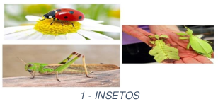
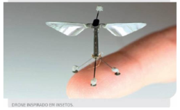
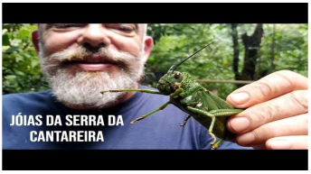
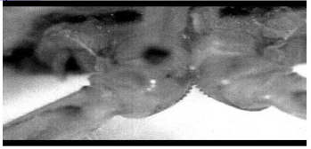
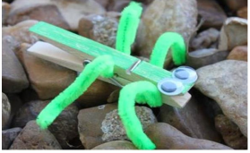
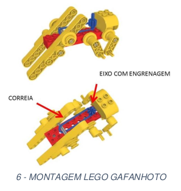
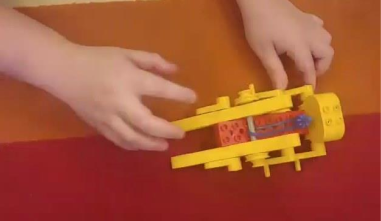
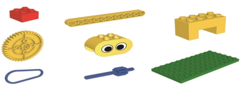

# Atividades do Dia 12/08/2020

## Vídeo-Aulas do Dia:

| Matéria | Assunto |Horário | Link | Meeting ID | Password |
|---------|---------|--------|------|------------|----------|
| [Ciências](#ciências) | livro de Ciências - Unidade 7 – O ciclo da água | 14:35 - 15:30 | [Zoom](https://zoom.us/j/3196566582?pwd=cFNUb3BrREpzanpQV2toZ09RbjFnUT09) | 319 656 6582 | 7qaBx5 |
| [História](#história) | O tempo nas diferentes culturas – Unidade 7 | 15:40 - 16:40 | [Zoom](https://zoom.us/j/3196566582?pwd=cFNUb3BrREpzanpQV2toZ09RbjFnUT09) | 319 656 6582 | 7qaBx5 |
| [Inglês](#inglês) | livro de Inglês | 17:30 - 18:30 | [Zoom](https://zoom.us/j/98980403597?pwd=Y1NUMHN0SlJIdzZRcHhVNkMyM3AyZz09) | 989 8040 3597 | 515592 | 
| [Robótica](#robótica-gafanhoto) | livro de Inglês | 17:30 - 18:30 | [Zoom](https://zoom.us/j/98980403597?pwd=Y1NUMHN0SlJIdzZRcHhVNkMyM3AyZz09) | 989 8040 3597 | 515592 | 

## CIÊNCIAS

### Plano de estudos

* Utilizar o planejamento da [plataforma AVA] Poliedro - Trilhas de Aprendizagem da **Semana 13/07 a 17/07** – **unidade 7: O ciclo da água**. Essa atividade se encontra no dia: **13/07**.
* Descrição da trilha de aprendizagem: **Leitura, interpretação, ciclo da água, mudanças climáticas e preservação ambiental**.
* O aluno deverá seguir as instruções da Trilha de Aprendizagem da [plataforma AVA], realizando os deveres no próprio material didático (livros e/ ou cadernos). Após finalizar as atividades, poderá concluir sua Trilha de Aprendizagem clicando no botão CONCLUIR TRILHA DE APRENDIZAGEM.
* Realizar atividades no livro de Ciências (páginas: 29 e 30). Enviá-las, no dia 12/08, pela [plataforma AVA], através da pasta ATIVIDADES (se encontra no MENU, abaixo da Trilha de Aprendizagem).

## HISTÓRIA

### Plano de estudos

* Utilizar o planejamento da [plataforma AVA] Poliedro - Trilhas de Aprendizagem da **Semana 06/07 a 10/07** – **Unidade 7– O tempo nas diferentes culturas**. Essa atividade se encontra no dia: **07/07**.
* Descrição da trilha de aprendizagem: **Leitura, interpretação os calendários nas diferentes culturas**.
* O aluno deverá seguir as instruções da Trilha de Aprendizagem da [plataforma AVA], realizando os deveres no próprio material didático (livros e/ ou cadernos). Após finalizar as atividades, poderá concluir sua Trilha de Aprendizagem clicando no botão CONCLUIR TRILHA DE APRENDIZAGEM.
* Realizar as atividades do livro de História (página: 25). Enviá-las, no dia 12/08, pela [plataforma AVA], através da pasta ATIVIDADES (se encontra no MENU, abaixo da Trilha de Aprendizagem).

## INGLÊS

* Realizar atividade do livro de Inglês (página: 105 – exercícios 3 e 4). Enviá-la, no dia 12/08, pela [plataforma AVA], através da pasta ATIVIDADES (se encontra no MENU, abaixo da Trilha de Aprendizagem).
* Realizar a “Atividade de Folha - Semana 19” disponível no anexo pela [plataforma AVA], através da pasta ATIVIDADES (se encontra no MENU, abaixo da Trilha de Aprendizagem).

## ROBÓTICA: GAFANHOTO

### Descrição da Atividade

Quantos insetos diferentes você conhece? Os cientistas já descobriram quase 1 milhão de espécies de insetos no mundo, são muitos, não é?

Para você ter uma ideia da quantidade de insetos existentes, pense o seguinte: se todos eles fossem divididos pelas pessoas que vivem no planeta, cada uma ficaria com cerca de 2 milhões de insetos!

Vamos nos aventurar pelo mundo dos insetos! Hoje, nosso encontro será sobre o gafanhoto, vamos lá?

### Desenvolvimento

#### Contextualização

O ser humano é um grande inventor de coisas, inventamos muitas máquinas e tivemos muitas ideias, mas já parou para pensar que a natureza pode ter inspirado o homem nestas criações?
  
Alguns exemplos:
  
  * A compreensão do voo dos pássaros ajudou na construção de aviões;
  * As moscas inspiraram a criação de drones;
  
Os insetos podem andar, voar, nadar ou saltar.

Você sabia que os insetos saltadores podem saltar até 200 vezes o comprimento do próprio corpo, pois possuem pernas traseiras muito desenvolvidas?
  
Link: <https://youtu.be/G6Iy4Oj0Y1U>

Um inseto que possui em sua estrutura algo muito parecido com engrenagens o que facilita os seus saltos. Clique no link abaixo para ver este fato curioso: <https://youtu.be/cq0Mf2pt2XA>
  

[O estranho inseto que possui engrenagens nas pernas](https://hypescience.com/conheca-o-inseto-que-tem-engrenagens-nas-pernas/)
  
#### Mão na massa

Você vai precisar de um prendedor de roupas de madeira para testar o salto do seu gafanhoto doméstico. Se você quiser, você pode pintar o prendedor de verde e até colocar olhos e patinhas!

Coloque o seu gafanhoto para saltar em uma superfície lisa. Faça diversos saltos até aprender o jeito certo de pressionar o prendedor.

<https://sway.office.com/rzIDmaNQllbNU3R9#content=Mk3SrkOW59rXML>

A mola do prendedor de roupa possui a mesma função das patas traseiras do gafanhoto, impulsionando o salto.

Esta é a montagem de um gafanhoto usando Lego. Perceba que ele possui uma correia em sua montagem, presa a um eixo com engrenagem que serve de apoio para que a correia elástica estique e o gafanhoto salte, assim como os músculos que o gafanhoto possui em suas pernas que o impulsionam a saltar.

#### Finalização

Observe que, quando movimentamos as vigas para trás, esticando a correia que está presa no eixo azul com engrenagem, criamos um impulso que, ao soltar a montagem, o nosso gafanhoto consegue dar um salto!

<https://sway.office.com/rzIDmaNQllbNU3R9#content=jkqDqwBsC5tR77>

As vigas amarelas e a correia fazem com que o gafanhoto ganhe impulso para saltar, da mesma forma que as grandes patas do gafanhoto fazem com que ele tenha este mesmo impulso!

Com o seu gafanhoto de prendedor de roupas, convide sua família para brincar e veja quem consegue fazer o melhor salto!

#### Diário de Bordo

Em seu diário de bordo, registre:

  * Quantos saltos o seu gafanhoto conseguiu dar em 1 metro?
  * Circule abaixo quais são as peças da caixa Lego responsáveis pelo salto do gafanhoto:

Registros fotográficos ou vídeos são sempre bem vindos, compartilhe com sua professora!

* Realizar a entrega da atividade através [plataforma AVA] na pasta de Matemática - Título: Robótica. Enviá-la até o dia 15/08, pela [plataforma AVA], através da pasta ATIVIDADES (se encontra no MENU, abaixo da Trilha de Aprendizagem).

* Ao divulgar nas redes sociais, utilizar a hashtag: #EmCasaComZOOMeducation e marcar o Instagram do CEPC. Boa Diversão!

* Realizar a atividade que se encontra ao final do Ped. Enviá-la, até o dia 15/08, pela [plataforma AVA], através da pasta ATIVIDADES (se encontra no MENU, abaixo da Trilha de Aprendizagem.)

---
[Voltar](index.md)

[plataforma AVA]: https://poliedro-ava.azurewebsites.net
