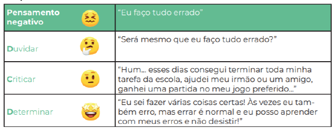

# Atividades do dia 23/04/2020

## PORTUGUÊS

* Vídeo aula no ZOOM : (Gramática - Acentuação Gráfica 2),dia 23/04 (Quinta-feira),das 13h10min às 14h.

  Link de acesso: 
  <https://us04web.zoom.us/j/78875702234?pwd=d0IyZ2JsVk03cEJpS1pCemxWeHV6Zz09>

    Meeting ID: 788 7570 2234
    Password: 5BgP1y

* Hoje vamos concluir os estudos da unidade. Você já sabe como é importante escrever corretamente para que todos compreendam nossos textos, não é mesmo?  Então, faça uma atividade sobre pontuação e a intencionalidade do texto. Leia o poema a seguir, que fala sobre três irmãs. Há três ou
quatro modos de pontuá-lo. Dependendo da pontuação empregada, o poeta declara seu amor por Soledade, por Lia ou por Iria. Ou, ainda, confessa estar indeciso.

    Três belas que belas são
    Querem que por minha fé
    Eu diga qual delas é
    Que adora o meu coração
    Se consultar a razão
    Digo que amo Soledade
    Não Lia cuja bondade
    Ser humano não teria
    Não aspiro à mão de Iria [...]
    (autor desconhecido)

Copie o poema em seu caderno e pontue-o de modo que poeta declare: 

    a) seu amor por Soledade. 
    b) seu amor por Lia. 
    c) seu amor por Iria. 

Leia a síntese sobre o conteúdo na página **121**. Faça as atividades das páginas **122** e **123**.

Bons estudos!

* Realizar as atividades do livro de Português e a pontuação do poema acima (Páginas **121**, **122**, **123** e caderno de Português). Enviá-las para o e-mail (no dia 23/04)

## PORTUGUÊS

Esse acesso ocorrerá apenas se você tiver alguma dúvida com relação ao conteúdo ou com as atividades propostas na disciplina de Língua Portuguesa.

* Vídeo aula no ZOOM :Plantão de Tira Dúvidas, dia 23/04 (Quinta- feira), das 14h20min às 14h50min.

Link de acesso:
<https://us04web.zoom.us/j/79927689608?pwd=ZVZPNERSY3FRcGwxRHNrVjNpdzZSZz09>

    Meeting ID: 799 2768 9608
    Password: 5GcwbH

## MATEMÁTICA

* Videoaula no Zoom – (livro de exercícios complementares de Matemática - Unidades 1 e 2), dia 23/04 (quinta-feira), das 16h às 16h40min.

  Link de acesso:
<https://us04web.zoom.us/j/78626381882?pwd=QkRUWiszOUdlZ0swb29BZmNwd0R0Zz09>

    ID da reunião: 786 2638 1882
    Senha: 6FRN3D

**Unidade 3 – As frações e a culinária dos países**. Nas atividades anteriores, você aprendeu a calcular frações de quantidades. Agora, você vai calcular frações de medidas.

1) Leia a página **116** do livro e faça a atividade **9**.
2) Procure em sua casa um copo ou jarra medidora e coloque nela *1/4 de litro de água*. Agora coloque mais água, completando *2/4 de litro* e, depois, *3/4 de litro*.
3) Leia a página **117** e faça a atividade **10**.
4) Calcular frações de medidas é como calcular frações de quantidades. Mas, em alguns casos, antes de calcular, precisamos realizar transformações. Por exemplo, transformar: *1 litro em 1 000 mililitros*. *1
metro em 100 centímetros*. *1 quilograma em 1 000 gramas*. Para finalizar, faça:

    a) as atividades **11** e **12** da página **118**.

    b) atividade **4** da página **135**.

Você sabia que existem vários tipos de frações?

1) Assista ao vídeo sobre Fração Própria disponível no link:
<https://www.youtube.com/watch?v=-MMObHliejA>

   Escreva exemplos de frações próprias em seu caderno.

2) Assista também ao vídeo sobre Fração Imprópria disponível no link:
<https://www.youtube.com/watch?v=XqVJT0MmVRs>

   Escreva exemplos de frações impróprias em seu caderno.

3) Assista ao vídeo sobre Fração Aparente disponível no link:
<https://www.youtube.com/watch?v=6N3De71JGnM>

Escreva exemplos de frações aparentes em seu caderno.

4) Para terminar, faça a atividade **13** da página **121** do livro.

Bons estudos!

-Realizar atividades do livro de Matemática (páginas **116**, **117**, **118**, **121** e **135**). Enviá-las para o e-mail (no dia 23/04)

## ESCOLA DA INTELIGÊNCIA

* Assistir a vídeoaula: <https://vimeo.com/401917244/eaf5d9863f>
* Lição 02 - As Armadilhas da Mente
* Aula 02 - Combatendo as armadilhas do coitadismo e do conformismo
* Link de acesso à história:
<https://eiprofessor.com.br/images/posts/aulas/L2_AM_P1_ALUNO_historias.pdf>

### Praticando o D. C. D.

Duvidar, criticar e determinar é uma ferramenta de gestão do pensamento. Identifique em você ou em outra pessoa da sua família se alguém verbalizou algum pensamento negativo, como, por exemplo: “***acho que não sou capaz de fazer tal coisa***”. Ajude-o a refletir sempre que for preciso.

    1o: duvide desse pensamento. Não acredite nele de imediato.
    2o: critique-o. Pense em outras tarefas difíceis que você foi capaz de realizar.
    3o: determine pensamentos positivos e ações que permitam a você oferecer seu melhor.

### Vamos praticar?

Monte uma tabela com o pensamento negativo e os três passos da técnica do D.C.D para decifrar o código da gestão dos pensamentos.
Exemplo de tabela:

Agora é a sua vez!

Sempre que um pensamento negativo vier, lembre-se das 3 letras poderosas: D. C. D!

* Realizar atividade proposta acima em uma folha avulsa. Enviá-las para o e-mail (no dia 23/04)

---

[Voltar](index.md)
