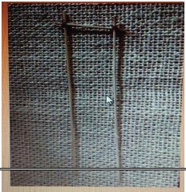
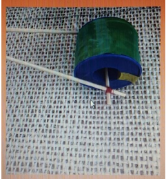
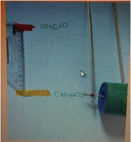

# Atividades do dia 24/04/2020

## INGLÊS

* Videoaula no Zoom: (Livro de Inglês - Unidade 3), dia 24/04 (sexta-feira), das 13h às 13h40min.

  Link de acesso:
<https://us04web.zoom.us/j/73121550512?pwd=d2VrSVJmZkZNRVhpU3JIam1ET2I5Zz09>

    Meeting ID: 731 2155 0512
    Senha: 012136

* Realizar atividade do livro de Inglês (página: 98, exercícios: 3 e 4). Enviá-las para o e-mail (no dia
24/04).

## MATEMÁTICA

* Videoaula no Zoom – (livro de exercícios complementares de Matemática - Unidade 2), dia 24/04
(sexta-feira), das 15h30min às 16h10min.

  Link de acesso: <https://us04web.zoom.us/j/71114736917?pwd=VFh1RzZxZWUySGV2QmNWcXJmWUIyQT09>

    ID da reunião: 711 1473 6917
    Senha: 8NEzEF

* Videoaula no Zoom – (livro de Matemática - Unidade 3), dia 24/04 (sexta-feira), das 16h20min às
17h.

  Link de acesso: https://us04web.zoom.us/j/77794371037?pwd=L1k1Z3F1Q3pLSXNtTVNnVEw0K2VDZz09

    ID da reunião: 777 9437 1037
    Senha: 0x1yi3

1) Ontem aprendemos sobre os tipos de fração: próprias, aparentes e impróprias. Hoje continuaremos
estudando esses conceitos. Leia o texto das páginas **118** a **121** do livro.

2) Caso ainda tenha dúvidas sobre as diferenças entre os tipos de frações, acesse um vídeo no link a
seguir: <https://www.youtube.com/watch?v=QLln70WSC48>

3) Em seguida, faça a atividade **5** da página **136** do livro.

### Unidade 3 – As frações e a culinária dos países

1) Convide pessoas que moram com você para jogar o “***Dominó das frações***”. Recorte as peças das
páginas **277** e **279** do seu livro.
2) Você já deve conhecer as regras do Dominó. Para relembrar, leia as regras na página **132**. Divirtam-se!

Continuando o conteúdo.

1) Vimos recentemente que as frações não representam apenas números menores que um inteiro.
Observe as frações a seguir:
<https://sistemapoliedrocom-my.sharepoint.com/:i:/g/personal/te_sistemapoliedro_com_br/EZBcn6nKMh1Di5yAGstwt08BBd2cxFN5UMCH-GTff-zkEw>
2) Agora, leia o texto da página **122** do livro e descubra outro modo de escrever essa fração. Você irá conhecer os números mistos.
3) Faça as atividades **14** e **15** da página **122** do livro.
4) Para compreender melhor os números mistos, assista ao vídeo disponível no link:
<https://www.youtube.com/watch?v=mq2YT_uMcS0>.

   Em seguida, escreva exemplos de números mistos em seu caderno.

5) Para terminar, faça a atividade **6** da página **137**.

Bons estudos!

* Realizar atividades do livro de Matemática (páginas **136**, **122**, **137**). Enviá-las para o e-mail (no dia 24/04).

## ARTES

* Videoaula disponivel no link: <https://www.youtube.com/watch?v=J2p2ObE2ICI>

  Leia as páginas **37**, **43**, **44** e **45** do seu livro. Faça as atividades propostas nas páginas **40**, **41** e **42**.
  
  Assista a um vídeo sobre como fazer massinha caseira para realizar a atividade da página **43** disponível no link: <https://www.youtube.com/watch?v=suV104Vadgs>

Para finalizar os estudos da unidade 2 assista aos vídeos sobre a importância dos museus disponível
no link: <https://www.youtube.com/watch?v=7XWeEBIeIvM>

Bons estudos!

* Realizar atividades do livro de Artes (páginas: 40, 41 e 42). Enviá-las para o e-mail ( no dia 24/04).

## ROBÓTICA

### Trena com roda

* Aula: Trena com roda

* Link para acesso e cadastro para realizar as atividades: https://emcasa.zoom.education/trena/

* Assista ao vídeo do link: <https://youtu.be/OeOTp42s_0o>

  O vídeo apresenta a trena analógica com rodas, seus benefícios e possíveis utilizações.
Vamos pensar quais são os instrumentos que você conhece para medir? Existem vários! Assista ao
vídeo a seguir para conhecer a trena com rodas e saber como é utilizada.

* Assista ao vídeo do link: <https://youtu.be/-_z6zm3zlJ0>

* Materiais necessários:
    * 3 palitos de madeira
    * Objeto cilíndrico com furo no meio (como na foto abaixo)
    * Linha de costura ou cordão
    * Fita crepe ou durex
    * Régua, trena ou fita métrica
    * Papel
    * Lápis

Quer descobrir a medida dos ambientes da sua casa, dos armários, camas, mesas e o que mais
encontrar? Então siga o passo a passo a seguir e construa sua própria trena com roda!

1. Pegue os palitos de madeira que você encontrou; corte dois deles na mesma medida (maior) e um
deles em uma medida menor que os demais.
2. Utilize a linha para amarrar os 3 palitos conforme a imagem abaixo:

   

3. Encaixe o objeto cilíndrico no palito menor e marque este objeto com uma fita ou caneta para que essa marcação sirva como “ponteiro”.

   

4. Utilizando o papel, uma fita, caneta ou lápis, marque o início do trajeto e veja até onde vai o 1o giro da sua roda. Marque o final do giro e veja com a trena, régua ou fita métrica qual foi a medida dessa distância.

   

5. Agora que você já sabe a distância de uma volta completa, você pode descobrir a medida do que quiser!

Por exemplo: 1 volta completa = 13 cm. Então, 3 voltas = 39 cm.

Pronto! Agora é só descobrir a medida de qualquer objeto que você encontrar na sua casa. Só não se esqueça de registrar no papel quantas voltas foram realizadas e, assim, você irá saber a medida do que quiser!

Mande uma foto bem bonita da sua trena e passe as medidas da sala da sua casa que você fez com a trena para o professor ou professora!

* Entrega das fotos de reprodução do material até o dia 24/04/20 pelo e-mail.

* Ao divulgar nas redes sociais, utilizar a hashtag: #EmCasaComZOOMeducation

---

[Voltar](index.md)
