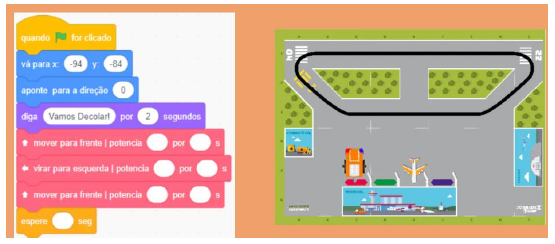

# Atividades do Dia 08/05/2020

## Vídeo-Aulas do Dia:

| Materia | Horário | Link | Meeting ID | Password |
|---------|---------|------|------------|----------|
| Inglês  | 13:05 - 13:45 | [Zoom](https://us04web.zoom.us/j/79189566435?pwd=YWp5UU5sWWRyUjltUlpCVlk1QzNwUT09) | 791 8956 6435 | 004397 |
| Matemática | 15:30 - 16:10 | [Zoom](https://us04web.zoom.us/j/76610399515?pwd=S1FROXFOR1p4TlBEMmR1Q21KVFR6QT09) | 766 1039 9515 | 6dhMLg |
| Matemática | 16:30 - 17:10 | [Zoom](https://us04web.zoom.us/j/74001471004?pwd=VmF3V2FvcnlMSnFyd3d2ancwdUR0QT09) | 740 0147 1004 | 9bDcqa |

## INGLÊS

* Realizar atividade do livro de Inglês (página 99 – exercícios 4 e 5). Enviá-las para o e-mail (no dia
08/05)

## MATEMÁTICA

### Plano de estudo

1) Vamos continuar estudando e comparando frações. Nos planos de estudo anteriores, fizemos a comparação de algumas frações utilizando dois métodos diferentes:

    * A tira de frações disponível no Material Complementar do livro.
    * O método das frações equivalentes. Acesse o vídeo para relembrar: <https://www.youtube.com/watch?v=XdAeooWsZ4Q>

  Você pode utilizar esses dois métodos para continuar comparando frações.

2) Faça os exercícios 9, 10 e 11 das páginas 139 e 140.

3) Acesse ao jogo a seguir para comparar frações: <https://www.cokitos.pt/comparar-fracoes/>

### Vamos revisar o que aprendemos nas últimas semanas.

1) Vimos que existem números não inteiros que podem ser escritos como fração. Acesse o jogo a seguir: <https://escola.britannica.com.br/jogos/GM_5_12/index.html>.

   Nele você decidirá se cada número é uma fração (não aparente) ou um número inteiro.

2) Aprendemos também a calcular frações de quantidades. Verifique esses conhecimentos no jogo a seguir: <https://escola.britannica.com.br/jogos/GM_6_11/index.html>

3) Aprendemos, ainda, a fazer redução ou simplificação de frações. Vamos nos divertir usando esse conhecimento. Acesse: <https://escola.britannica.com.br/jogos/GM_4_18/index.html>

* Realizar atividades do livro de Matemática (exercícios 9, 10 e 11 das páginas 139 e 140). Enviá-las
para o e-mail (no dia 08/05)

## ROBÓTICA

Decolando com Zoom Education.

* Link para acesso e cadastro para realizar as atividades: <https://emcasa.zoom.education/>

  A partir de agora, utilizaremos a plataforma Scratch para algumas atividades de programação. Em nossa Base de Missões, o nosso robô LudoBot será nosso o avião e propomos um desafio que, a partir dos blocos apresentados, você realize curvas e outros movimentos. Vamos lá?
  
  Materiais: 
   * Computador ou notebook com acesso à internet; 
   * esta atividade impressa para registrar seus desafios;
   * para acessar o Scratch com a Base de Missões “Aeroporto”
   
    <https://scratch.mit.edu/projects/382735688/>
    
* Veja os links de como utilizar a plataforma Scratch

  * https://www.youtube.com/watch?v=XvczEGVhA1U&feature=youtu.be
  * https://www.youtube.com/watch?v=d09QZ7sA-bc&feature=youtu.be
  * https://www.youtube.com/watch?v=r8ayb_reyEU&feature=youtu.be

* Link para produção: https://youtu.be/yn9vaMDBNpY

### DESAFIOS DE PROGRAMAÇÃO

Vamos colocar nosso LudoBot para decolar? É simples! Você só precisa seguir as instruções do desafio, criar sua programação e testar!

  **Atenção aos valores da potência e do tempo de deslocamento do LudoBot!**

O desafio é simples: o LudoBot precisará iniciar a programação em um ponto determinado e se deslocar para o abastecimento e permanecer por um tempo. Em seguida, você deverá levá-lo até o hangar, para checar as peças. Só então estará pronto para decolar!

#### DESAFIO 1 – POSICIONAR O LUDOBOT NO TERMINAL E LEVÁ-LO AO ABASTECIMENTO

1. Inicie o LudoBot no quadrante 5C, de frente para o quadrante 4C;
2. Adicione a frase “Vamos decolar!” por 2 segundos para iniciar o deslocamento;
3. Leve o LudoBot até o quadrante 4B, de frente para o abastecimento, e deixe um pequeno tempo para o abastecimento;

##### Dica 1

Para encontrar os valores “-94” e “-84”, você pode deslocar o LudoBot com o mouse para a posição solicitada e verificar esses valores como na imagem abaixo:

##### Dica 2

Com este bloco, você poderá definir a direção do seu LudoBot.

**Observação**: Utilizar esses 2 blocos apenas no começo da programação, para posicionamento do LudoBot. Ele é usado para colocar o LudoBot no quadrante inicial dos comandos.

##### REGISTRO

Anote quais os valores de potência e de tempo de espera utilizados para resolver o desafio, e desenhe.

#### DESAFIO 2 – CURVAS PARA DECOLAGEM

1. Dê continuidade a sua programação e siga para o quadrante 4H, de frente para o hangar, e deixe esperando um pequeno tempo também;
2. Em seguida, leve o LudoBot para o quadrante 1I, direcionado para a pista para decolagem (de frente para o 1H), e espere por mais um tempo;

##### REGISTRO

Anote quais os valores de potência e tempo de espera utilizados para resolver o desafio.

#### DESAFIO 3 – DECOLAGEM

1. Por fim, continue e faça o LudoBot atravessar toda a pista até o final, ficando posicionado no quadrante 1A, e finalize apresentando a frase “Decolando com ZOOM Education” por 4 segundos.

##### REGISTRO

Anote quais os valores de potência e tempo de espera utilizados para resolver o desafio. 

Com a programação completa, teste seu LudoBot. Você pode fotografar ou gravar um vídeo dos desafios e enviar para seu professor.

Boa diversão!

* Entrega das fotos de reprodução do material até o dia 08/05 pelo e-mail

* Ao divulgar nas redes sociais, utilizar a hashtag: #EmCasaComZOOMeducation e marcar o Instagram do CEPC.

---
[Voltar](index.md)
