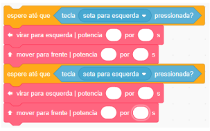

# Atividades do Dia 12/06/2020

## Vídeo-Aulas do Dia:

| Matéria | Assunto |Horário | Link | Meeting ID | Password |
|---------|---------|--------|------|------------|----------|
| [Artes](#artes) | Teatro brasileiro | - | [YouTube](https://www.youtube.com/watch?v=z5E4eN-Ecww) | - | - |
| [Artes](#artes) | Teatro brasileiro | - | [YouTube](https://www.youtube.com/watch?v=SisBCTYHJ1I) | - | - |
| [Robótica](#robótica) | Programação Scratch | - | [Scratch](https://scratch.mit.edu/projects/383447458/) | - | - |

## ARTES

### Plano de Estudos:
- Videoaula: <https://www.youtube.com/watch?v=z5E4eN-Ecww> e <https://www.youtube.com/watch?v=SisBCTYHJ1I>

* Utilizar o planejamento da [plataforma AVA] Poliedro - Trilhas de Aprendizagem da Semana 04/05 a 08/05 Unidade 4 – O Brasil e o teatro. Essa atividade se encontra no dia: 07/05
* Descrição da trilha de aprendizagem: Teatro brasileiro
* O aluno deverá seguir as instruções da Trilha de Aprendizagem da [plataforma AVA], realizando os deveres no próprio material didático (livros e/ ou cadernos). Após finalizar as atividades, poderá concluir sua Trilha de Aprendizagem clicando no botão CONCLUIR TRILHA DE APRENDIZAGEM.
* Realizar as atividades do livro de Arte (páginas: 81,82 e 83). Enviá-las no dia 12/06, pela [plataforma AVA], através da pasta ATIVIDADES (se encontra no MENU da página da atividade).

## ROBÓTICA

### Programação Scratch

Olá! Vamos dar continuidade com nossos desafios na linguagem de programação Scratch! Dessa vez, iremos utilizar as teclas do teclado para controlar nosso LudoBot. Essas teclas serão como um sensor de toque em que, ao acionarmos a tecla escolhida, o LudoBot fará determinado deslocamento.

Nessa atividade, você conhecerá os blocos de controle “espere até que” e de sensores “tecla (escolha qual tecla) pressionada”. Você perceberá que esses blocos se encaixam para obter um só comando.

#### Materiais necessários:

  * Computador ou notebook com acesso à internet;
  * Esta ficha impressa para registrar seus desafios;
  * Acesse o link abaixo para obter a base de missão no Scratch. Link: <https://scratch.mit.edu/projects/383447458/>
  
Mãos na massa! Desafios de programação:

Vamos colocar nosso LudoBot para se deslocar a partir das teclas do teclado do seu computador?

É simples, você só precisa seguir as instruções do desafio, criar sua programação e testar!

Atenção aos valores da potência e do tempo de deslocamento do LudoBot.

#### DESAFIO 1 – DESLOCAMENTO POR TECLADO

Posicione o LudoBot no quadrante B4 de frente para o C4, e quando a tecla “seta para cima” for pressionada, ele deverá se mover por 4s até o quadrante H4, de frente para o farol.

##### DICA

Para acionar o comando para que o LudoBot se desloque, utilize os dois blocos representados a baixo. O “espere até que” determina que o LudoBot ficará esperando até que o comando seja acionado. Utilize o bloco “tecla (escolha a tecla) pressionada” e escolha a tecla que deseja, nesse caso, seta para cima, para que o comando seja acionado. Ao selecionar a tecla, encaixe o bloco dentro do “espere até que”, deste modo:

##### REGISTRO
Anote quais os valores de potência são utilizados para resolver o desafio:

#### DESAFIO 2 – CURVAS COM COMANDO DE TECLA

Continue sua programação e acione o LudoBot para se deslocar até o quadrante H2 ao ser pressionado a seta para esquerda. Em seguida, programe o LudoBot para se deslocar até o quadrante F2, de frente para o armazém, após a seta para esquerda ser pressionada novamente.

##### REGISTRO

Anote quais os valores de potência e tempo de deslocamento são utilizados para resolver o desafio:

#### DESAFIO 3 – POTÊNCIA, CURVAS E ESPERAR
Com o LudoBot já posicionado no quadrante F2 de frente para o armazém, dê continuidade com a sua programação, fazendo com que ele se desloque para o quadrante F4, de frente para o porto, ao ser acionado a tecla “P” do teclado. Em seguida, o LudoBot irá esperar por 3 segundos e retornará ao quadrante F2.

##### REGISTRO

Anote quais os valores de potência e tempo de deslocamento são utilizados para resolver o desafio:

#### DESAFIO 4 – FINALIZAÇÃO
Para finalizar sua programação, programe o LudoBot para se deslocar até o quadrante E3, de frente para o guindaste, ao ser pressionado a tecla “G” do seu teclado.

##### REGISTRO

Anote quais os valores de potência e tempo de deslocamento são utilizados para resolver o desafio e desenhe o caminho percorrido em uma folha:

Agora que terminou os desafios, você pode testar todo o percurso e, se desejar, realizar outros deslocamentos. Fotografe ou grave um vídeo dos desafios e envie para seu professor!

Boa diversão!

* Realizar a entrega das fotografias através da [plataforma AVA] na pasta de Matemática
* Título: Robótica. Enviá-la até o dia 12/06, pela [plataforma AVA], através da pasta ATIVIDADES (se encontra no MENU, abaixo da Trilha de Aprendizagem).
* Ao divulgar nas redes sociais, utilizar a hashtag: #EmCasaComZOOMeducation e marcar o Instagram do CEPC. Boa Diversão!

---
[Voltar](index.md)

[plataforma AVA]: https://poliedro-ava.azurewebsites.net
